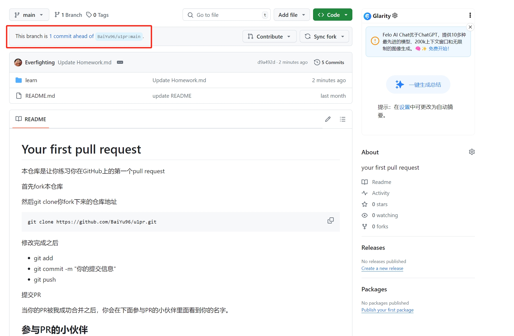
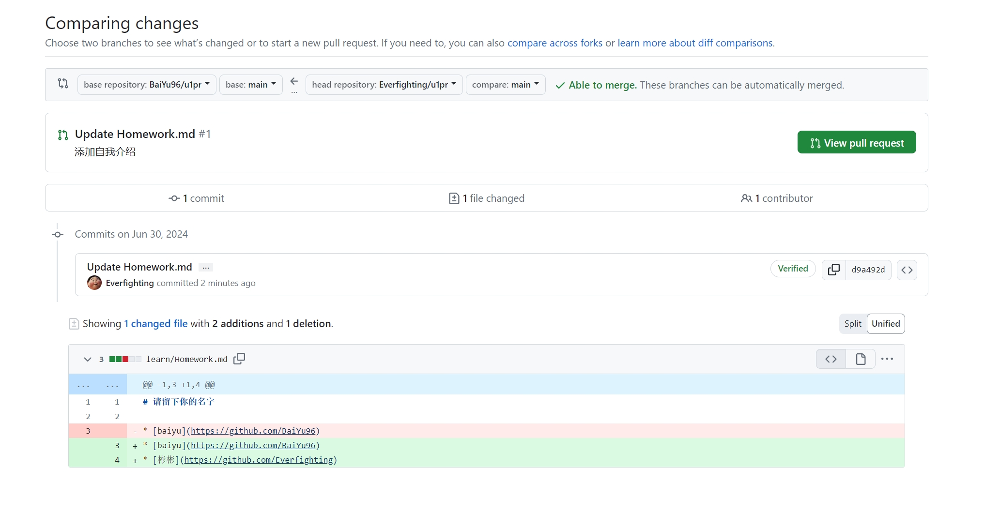
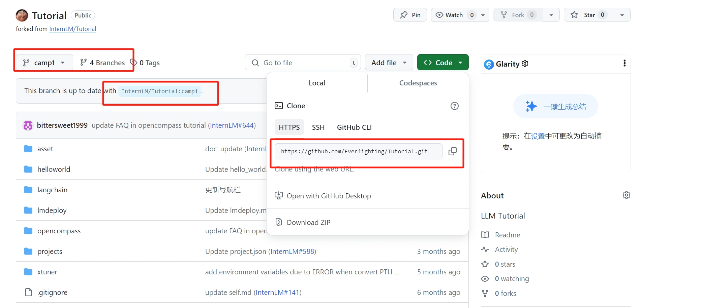
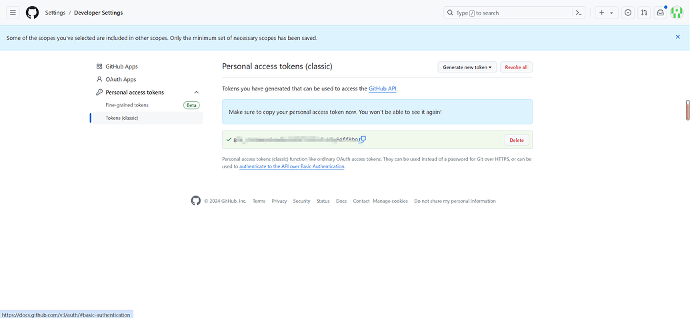
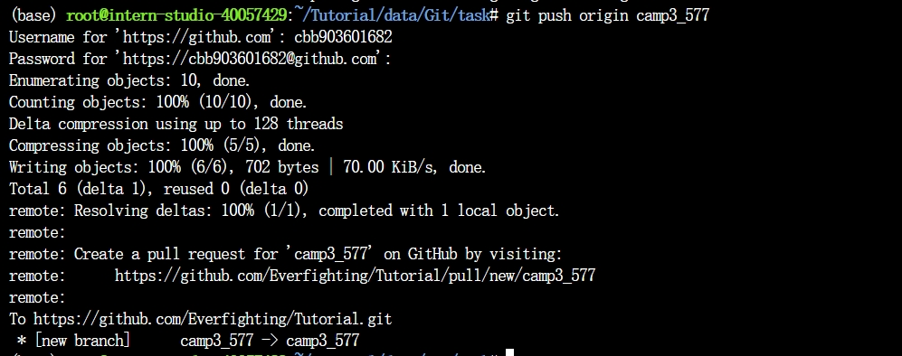
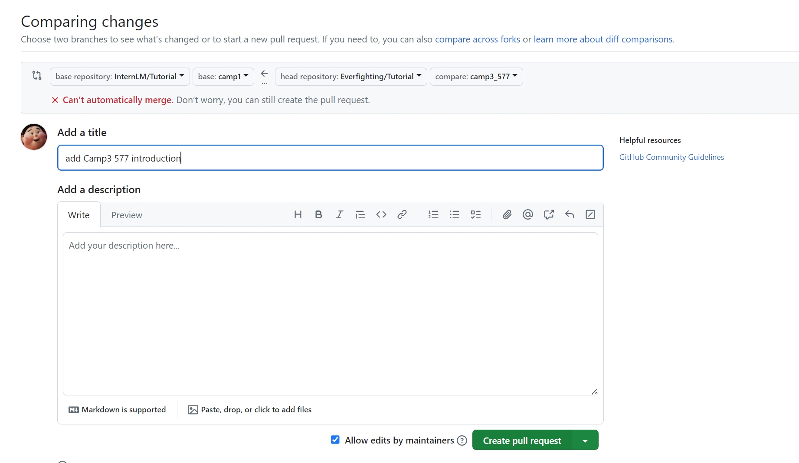
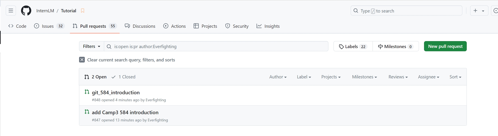
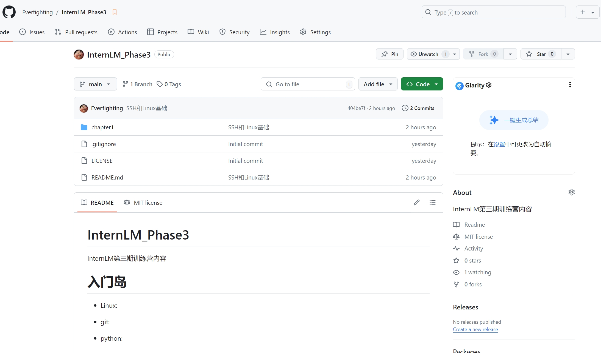

# 闯关任务

## 学习内容

git支持代码持续集成和版本管理等相关功能。

### 常见的命令
```
git add 添加文件

git commit 提交文件

git branch 分支

git checkout 切换分支

git merge 合并分支

git clone 克隆仓库

git push 推送代码

git pull 拉取代码

git status 查看状态

git log 查看日志

git reset 回滚代码

git revert 回滚代码

git diff 查看差异

git tag 标签

git remote 远程仓库

git rebase 变基

git stash 暂存
```

###  教程作业：提交一个PR





## 任务1
破冰活动：向仓库提交自我介绍

拷贝复制自我介绍模版和仓库



生成复制git提交token



提交仓库



PR信息提交



PR提交记录



## 任务2

实践项目：构建个人项目

创建了仓库，命名为InternLM_Phase3用来进行提交作业。




