# 闯关任务

## 1、完成SSH连接与端口映射并运行hello_world.py

熟悉相关的开发环境，初期先选取10%A100服务器，创建名称和相关的基础镜像环境。

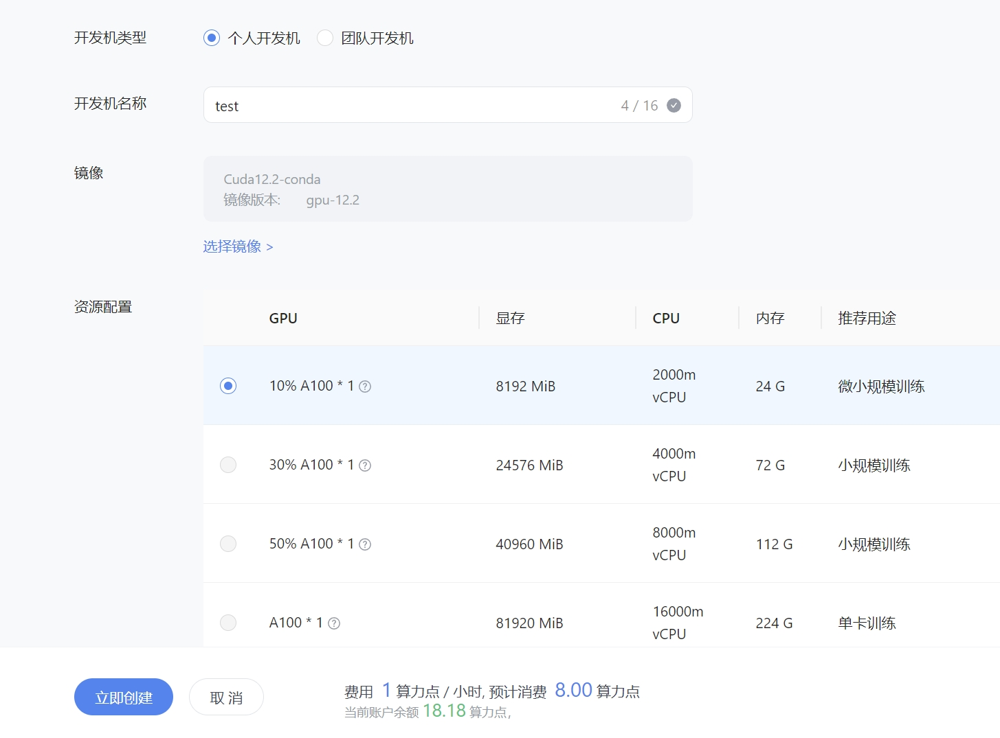

开机之后使用ssh连接进入服务器, 可以配置密钥方便登录，将本地生成的公钥加入到开发机平台上。 

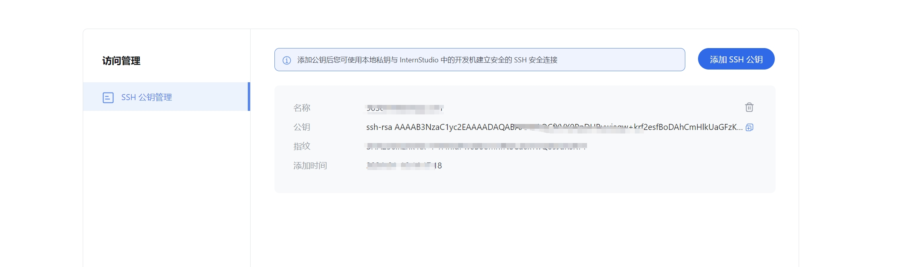

连接成功后, 使用nvidia-smi命令查看GPU情况。

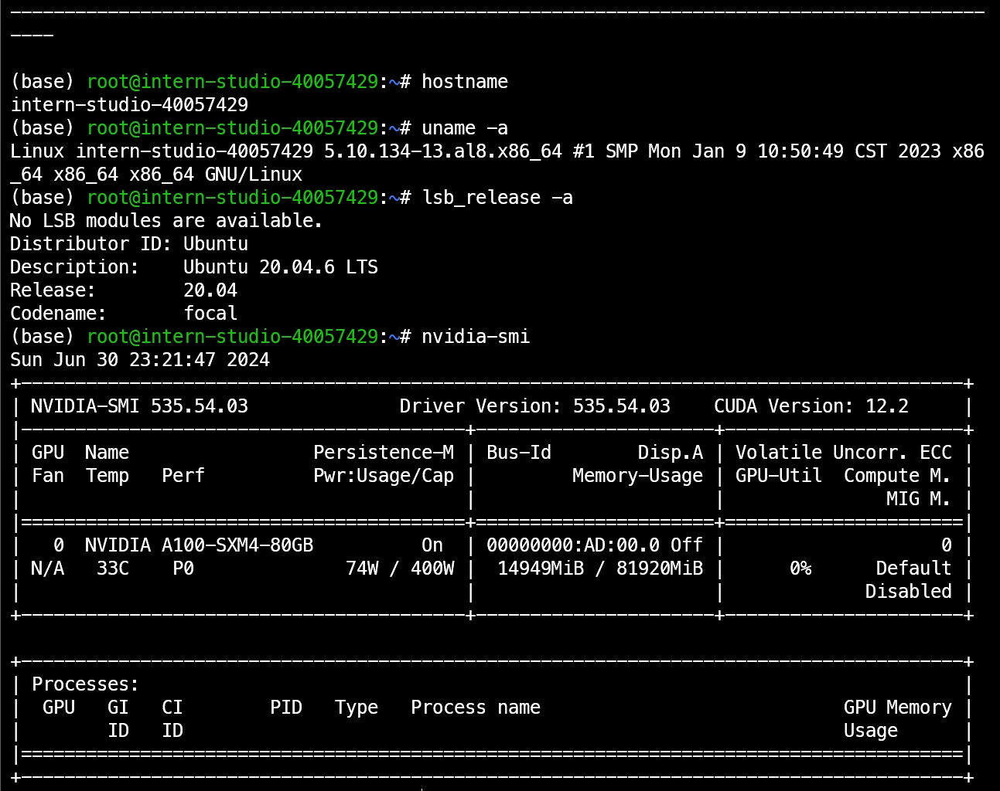

页面展示的时候要进行本地对远程服务器的转发。

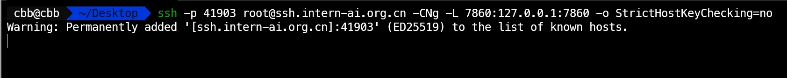

编写展示页面的hello_world.py文件, 使用gradio库进行展示。

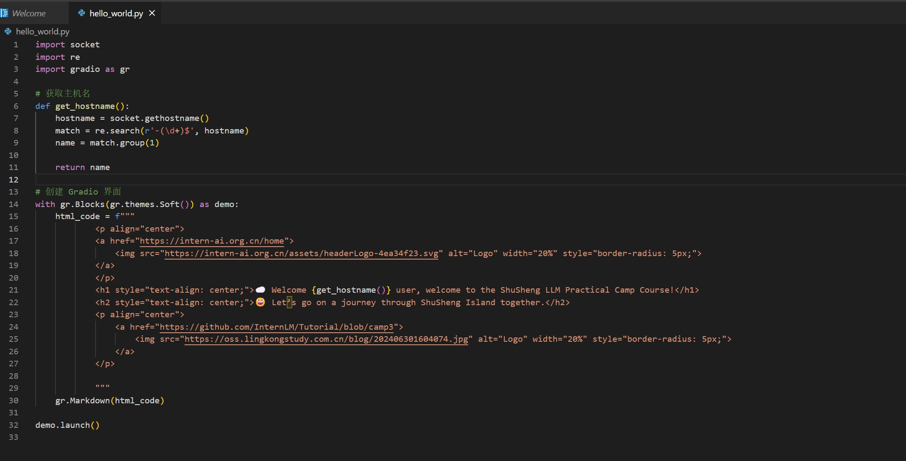

安装相关gradio安装包。

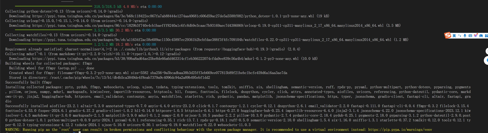

运行hello_world.py文件, 在本地浏览器中输入http://localhost:7860进行展示。

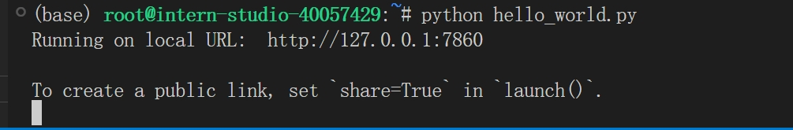

展示效果
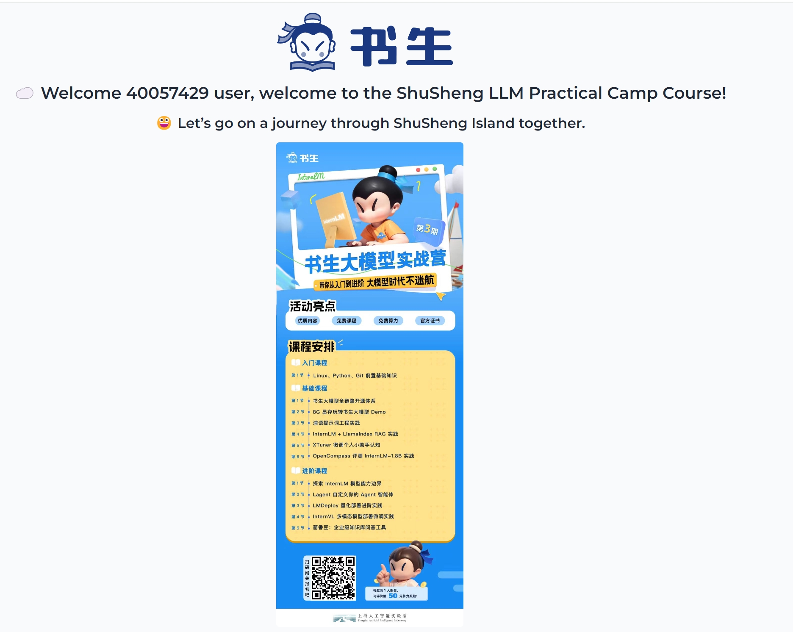

## 2、可选任务 1：将Linux基础命令在开发机上完成一遍

Linux相关指令

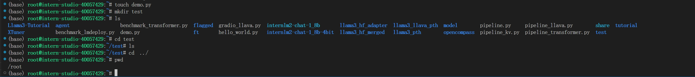

Linux指令2

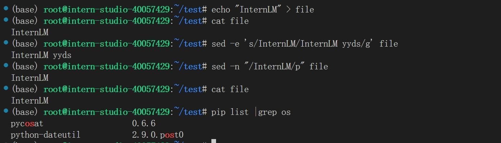

conda相关的信息

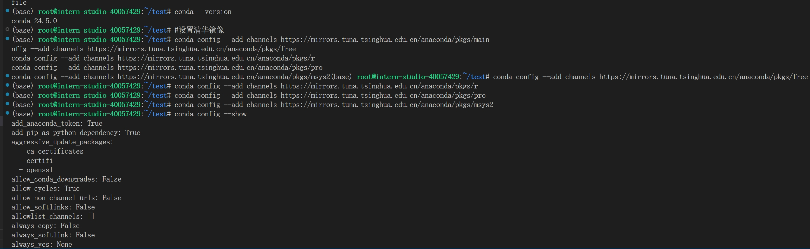

显卡信息对照表

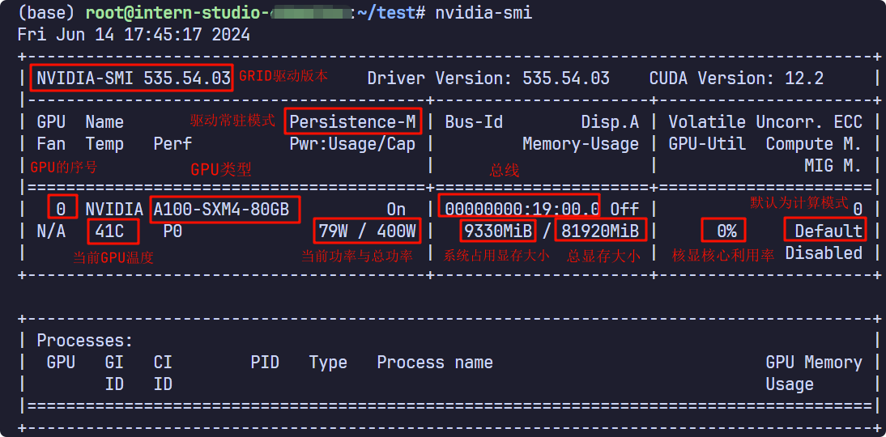

显卡情况

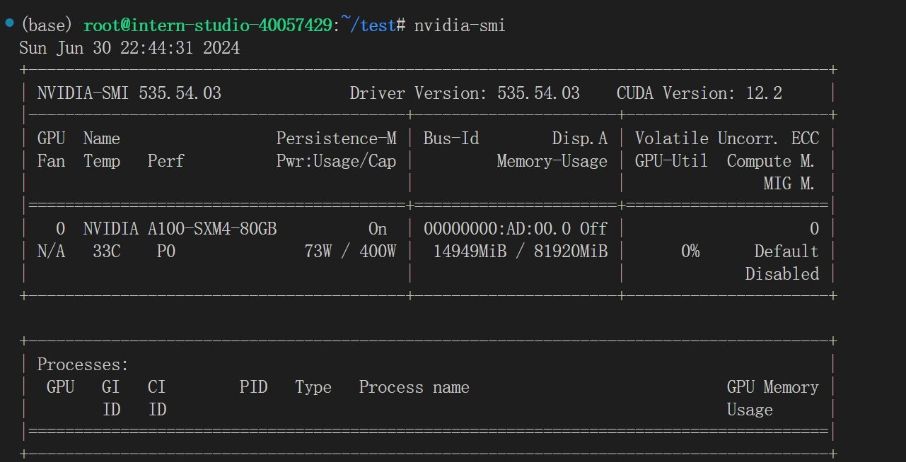

查看系统相关信息

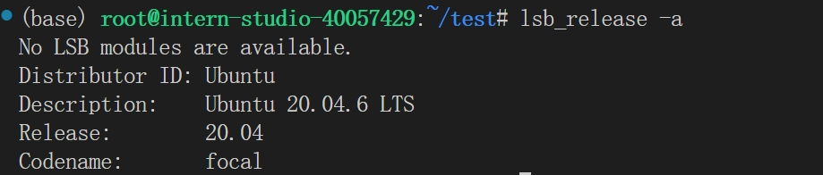

tmux的相关操作
安装tmux
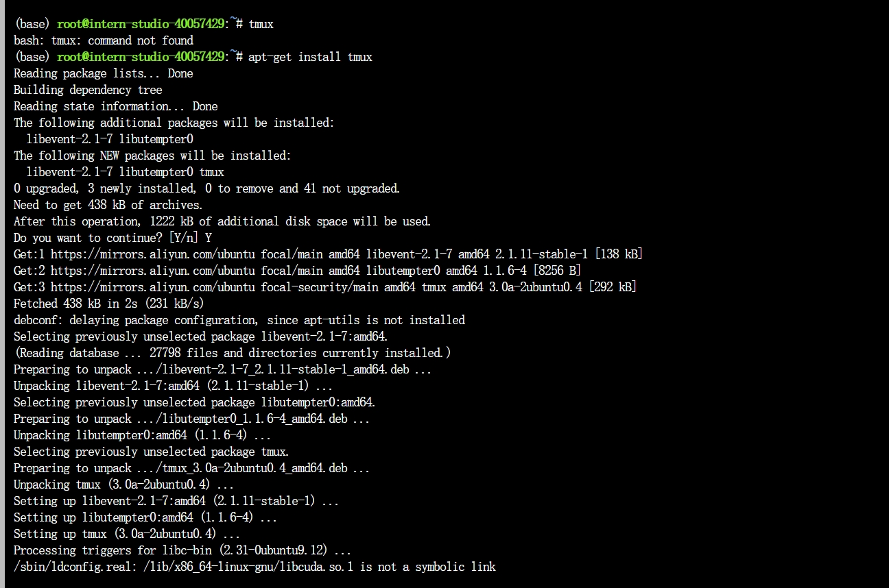

tmux相关用法
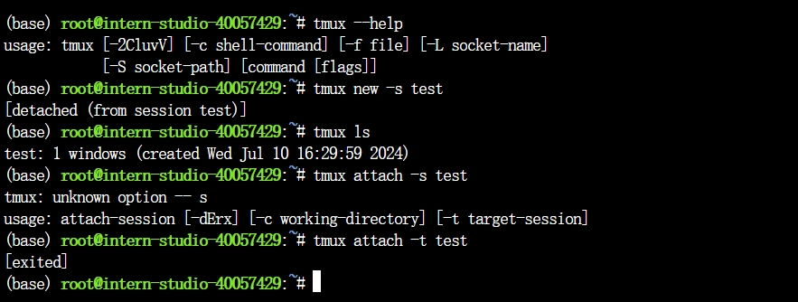

- **启动新的 `tmux` 会话**：

    `tmux`

- **启动新的 `tmux` 会话并指定名称**：

    `tmux new -s session_name`

- **退出当前 `tmux` 会话**：

    `exit`

- **列出所有 `tmux` 会话**：

    `tmux ls`

- **重新连接到已存在的会话**：

    `tmux attach -t session_name`

- **切换到另一个会话**：

    `tmux switch -t session_name`

- **杀死一个会话**：

    `tmux kill-session -t session_name`

## 3、可选任务 2：使用 VSCODE 远程连接开发机并创建一个conda环境
安装VSCODE连接插件

连接成功
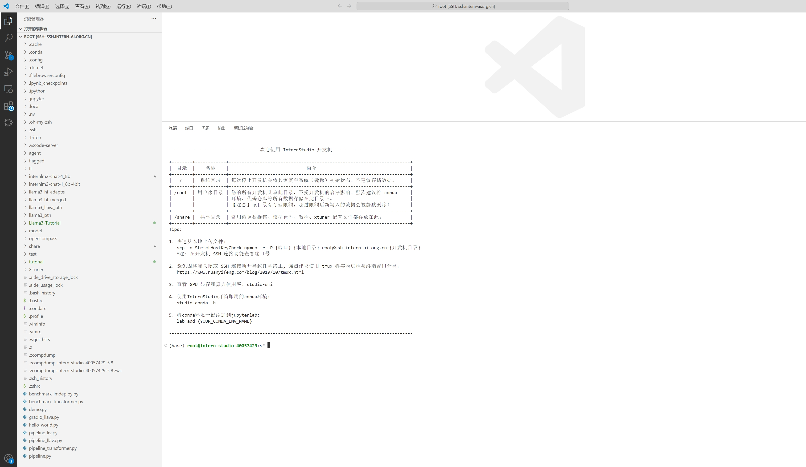

创建新的conda环境

`conda create --name myenv python=3.8`

查看虚拟环境命令

`conda env list`
`conda info -e`
`conda info --envs`

## 4、可选任务 3：创建并运行test.sh文件

创建还原虚拟环境的shell脚本： 

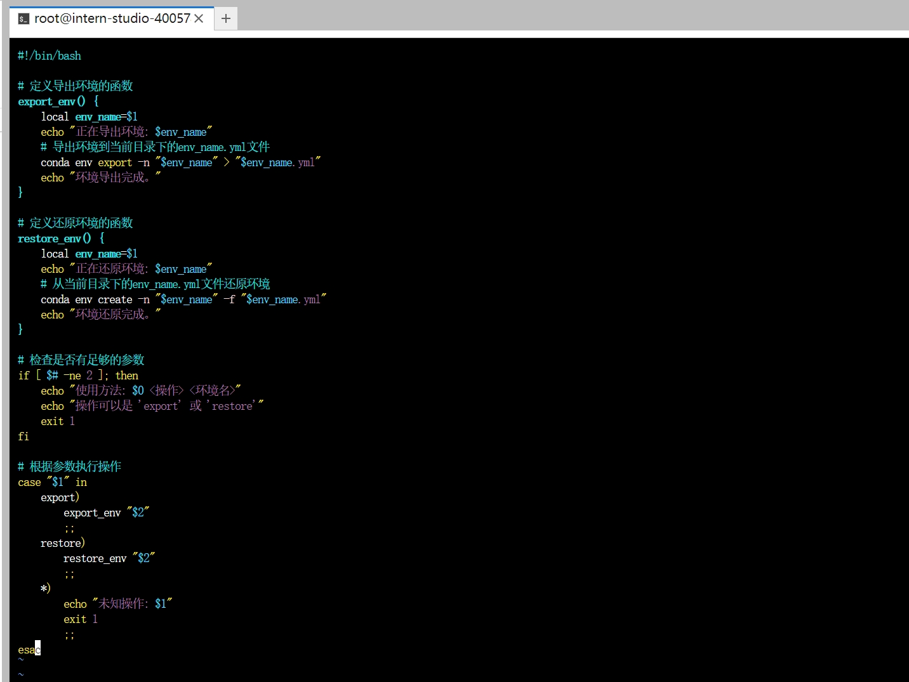

给予权限，执行相关脚本，还原xtuner环境

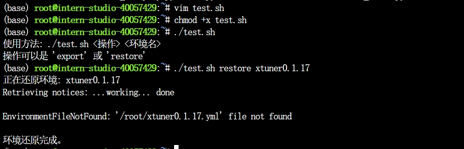

相关脚本代码分析：
    - 脚本定义了一个导出环境和恢复创建环境的方法。
    - 在运行时首先检查参数是否足够。
    - 参数正确则运行相关指令。