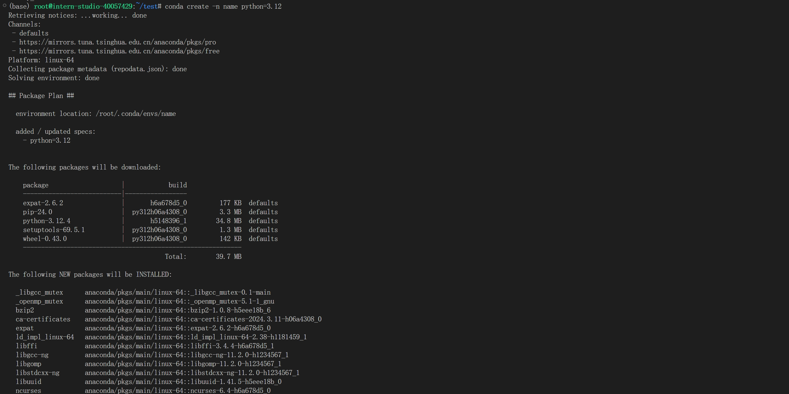
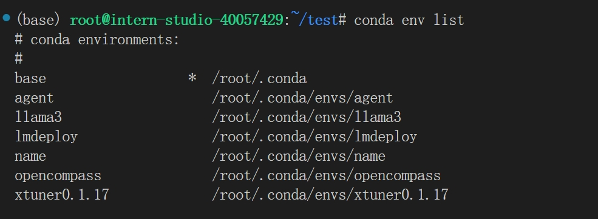
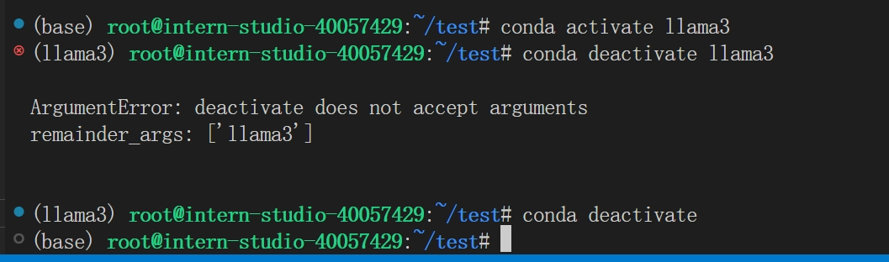
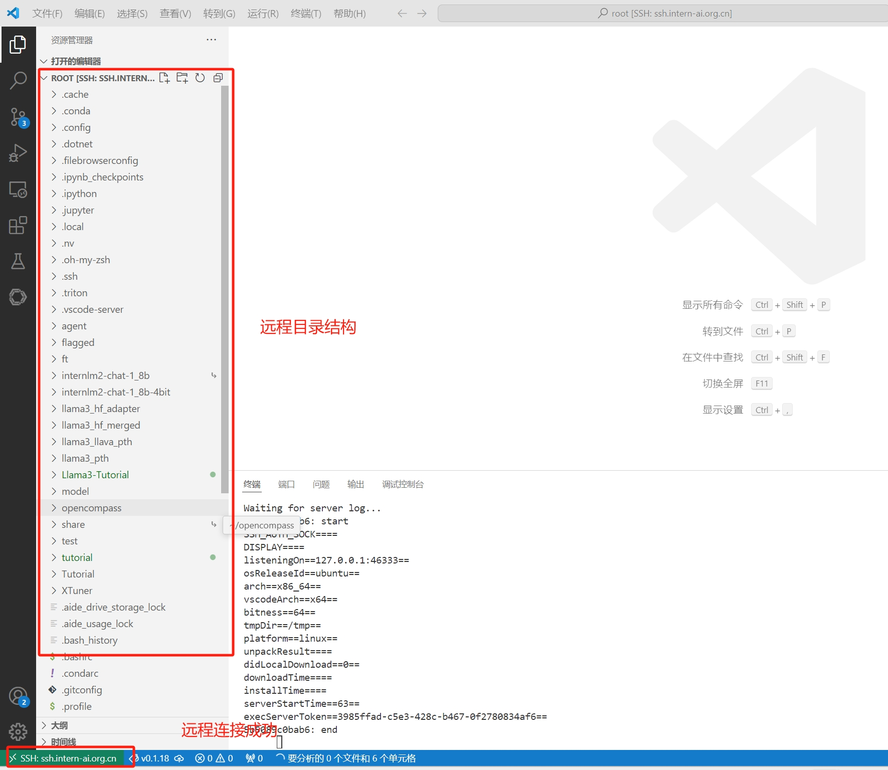
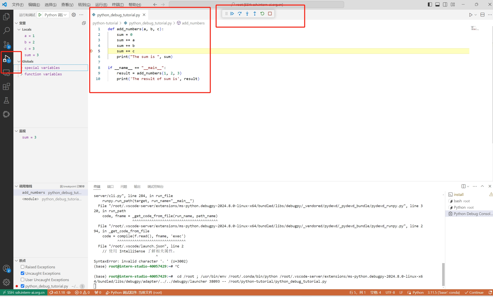
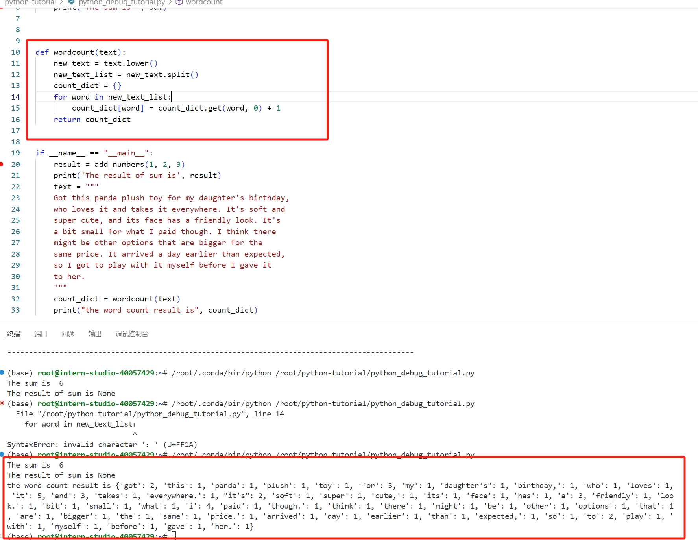
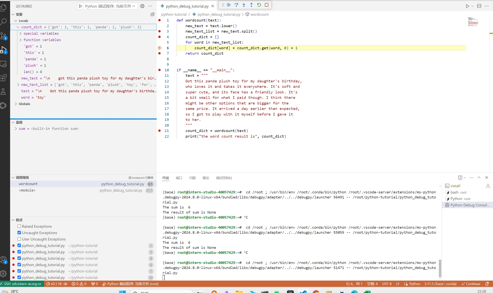

# 闯关作业

## 教程内容

conda 开源软件包管理和环境管理系统，用户环境隔离，确定软件版本环境，适用于不同平台系统，Windows、Mac和Linux。 

常用命令：
```Shell
conda list  查看所有的conda环境中的安装包
conda create 创建新的conda环境
conda activate 激活对应的conda环境
conda deactivate  退出已激活的conda环境
conda install  在激活环境中安装相应的包
conda update  更新包或conda到最新的版本
conda remove  从当前环境中卸载包
conda env list 显示所有已创建的环境 
```

如果是国内镜像下载需要链接境外服务器导致网络较慢，可以尝试修改成本地的服务

```Shell
pip config set global.index-url https://pypi.tuna.tsinghua.edu.cn/simple             
```

创建conda环境：
```Shell
conda create -n python-tutorial python=3.10  #创建环境
conda activate python-tutorial  # 激活环境
pip install jupyter lab  # 安装相应的包
pip install numpy

conda activate python-tutorial # 激活环境 
jupyter lab # 打开jupyter lab 
```

vscode远程连接开发机器
- 下载vscode
- 下载插件 remote-ssh 
- 设置remote ssh连接方法
- 连接远程后，选择对应环境
- 进行代码debug

虚拟环境的创建



查看虚拟环境列表



激活和退出环境



vscode远程连接



远程debug




## 任务一

请用Python实现一个wordcount函数，统计英文字符串中每个单词出现的次数。返回一个字典，key为单词，value为对应单词出现的次数。
    TIPS：记得先去掉标点符号,然后把每个单词转换成小写。不需要考虑特别多的标点符号，只需要考虑实例输入中存在的就可以。
    Eg:
    Input:
Hello world!  
This is an example.  
Word count is fun.  
Is it fun to count words?  
Yes, it is fun!
    Output:
{'hello': 1,'world!': 1,'this': 1,'is': 3,'an': 1,'example': 1,'word': 1,      'count': 2,'fun': 1,'Is': 1,'it': 2,'to': 1,'words': 1,'Yes': 1,'fun': 1  }
text = """
Got this panda plush toy for my daughter's birthday, 
who loves it and takes it everywhere. It's soft and 
super cute, and its face has a friendly look. It's 
a bit small for what I paid though. I think there 
might be other options that are bigger for the 
same price. It arrived a day earlier than expected, 
so I got to play with it myself before I gave it 
to her.
"""

字符统计函数


    
## 任务二
请使用本地vscode连接远程开发机，将上面你写的wordcount函数在开发机上进行debug，体验debug的全流程，并完成一份debug笔记(需要截图)。

字符统计debug过程截图

