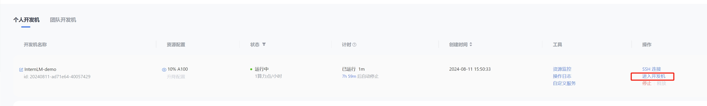
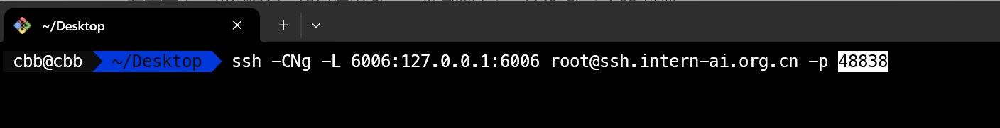

# 8G 显存玩转书生大模型 Demo
## 基础任务
> 使用 Cli Demo 完成 InternLM2-Chat-1.8B 模型的部署，并生成 300 字小故事，记录复现过程并截图。
## 进阶任务
> 使用 LMDeploy 完成 InternLM-XComposer2-VL-1.8B 的部署，并完成一次图文理解对话，记录复现过程并截图。
> 使用 LMDeploy 完成 InternVL2-2B 的部署，并完成一次图文理解对话，记录复现过程并截图。


基础任务操作：
1、进行相关环境的配置和工具包的安装


因为已经内置好了环境，只需要激活环境即可

```conda activate /root/share/pre_envs/icamp3_demo```

2、加载本地模型，进行命令行推理
创建文件夹和脚本，脚本代码解读


3、启动模型进行推理


4、任务完成，300字的小故事


streamlit可视化进行推理结果的展示：

1、Streamlit Web Demo 部署 InternLM2-Chat-1.8B 模型


2、进行端口转发




进阶任务操作：

1、LMDeploy 部署 InternLM-XComposer2-VL-1.8B 模型


进行图文问答：


2、LMDeploy 部署 InternVL2-2B 模型


进行图文问答结果：


InternVL2-2B 模型的回复结果更符合真实场景。
