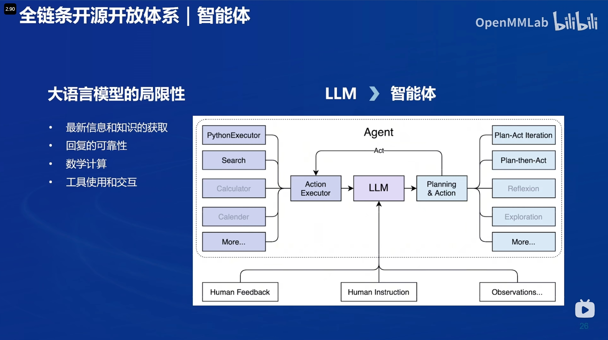

# 书生浦语开源体系发展历程
## 书生浦语开源一周年，不仅逐步迭代了InternLM系列模型，还逐步完善了相关工具链的使用，大大降低了开源大模型训练、学习和使用的门槛。

# 模型能力的逐步提升

# 最新发布的浦语2.5

# 核心思路-高质量数据合成
## 多种方法助力高质量数据的合成

# 领先推理能力

## 不需要提示词工程推理能力也能很强

# 超长上下文的大海捞针实验

# 基于规划和搜索解决复杂问题

# 书生浦语模型谱系
## 书生浦语模型谱系包含不同的参数规模，下游实现了多种功能的模型，如文生图、数学题、高考相关的领域模型。

# 全链条开源-与社区生态无缝链接
## 包括大模型训练的各个环节的相关工具
### 数据：书生-万卷
### 预训练框架：InternEvo
### 微调工具：Xtuner 
### 部署工具：LMDeploy
### 评测工具：OpenCompass
### 下游应用： HuixiangDou、MinerU、Lagent、MindSearch

# 全链条开源开放体系-数据

# 全链条开源开放体系-开源数据处理工具箱

# 全链条开源开放体系-预训练

# 全链条开源开放体系-微调Xtuner

## xtuner能力比较

# xtuner零显存浪费

# 全链条开源开放体系-opencompass评测体系

# opencompass三位一体介绍
包括三个方面：
- 全栈测评工具
- 测评集社区
- 权威性能榜单

# 全链条开源开放体系-OpenCompass评测体系

# 全链条开源开放体系-部署LMDeploy

## LMDeploy的领先推理性能

# 全链条开源开放体系-智能体

# 全链条开源开放体系-智能体LAgent

# Lagent应用

# 全链条开源开放体系-智能体MindSearch

# 全链条开源开放体系-知识库构建工具茴香豆
