# 提示工程

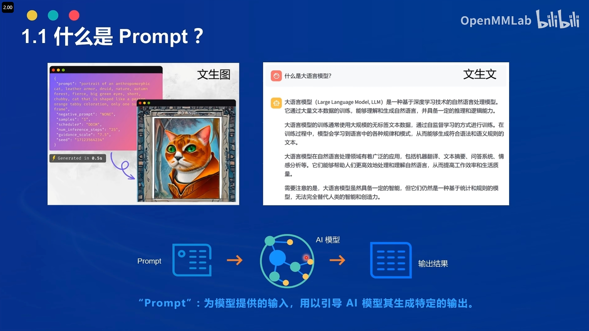
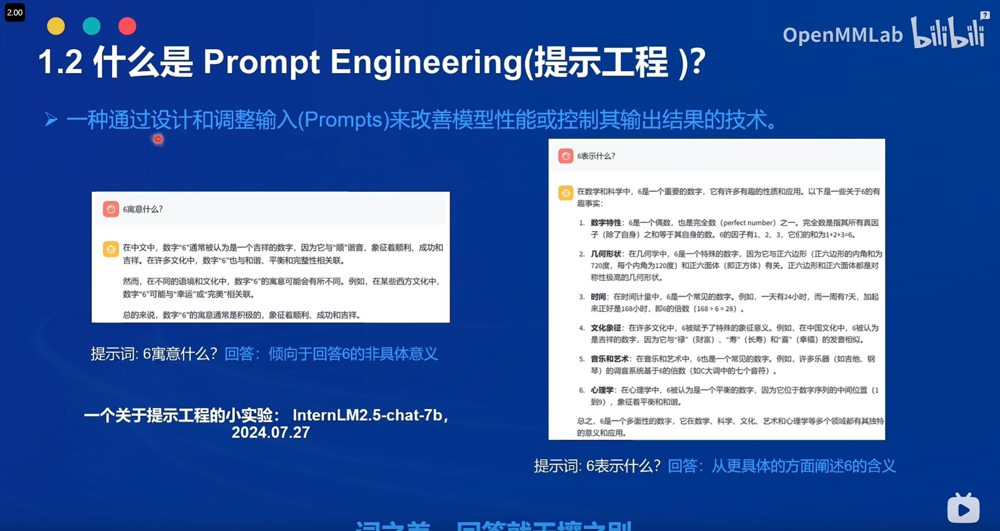
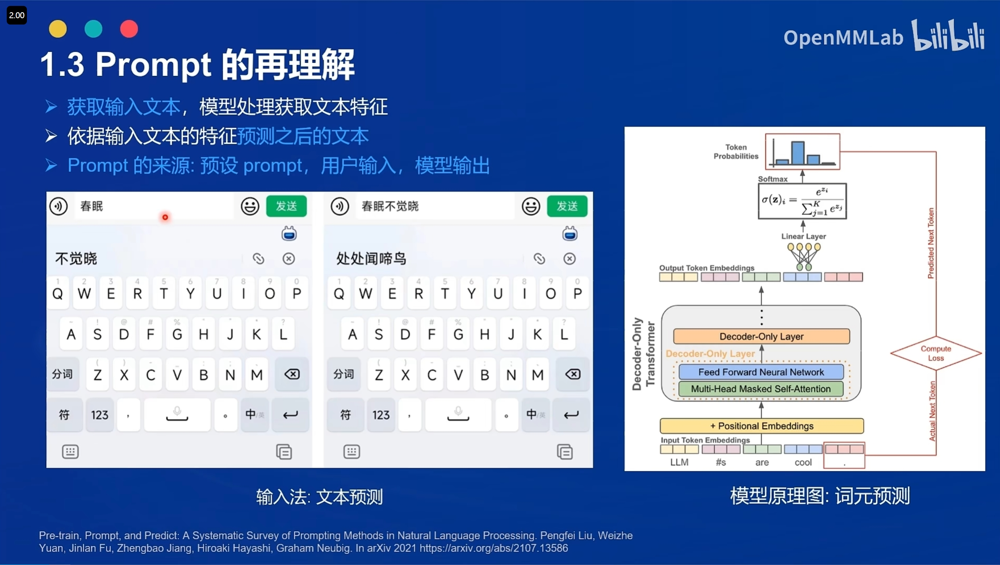
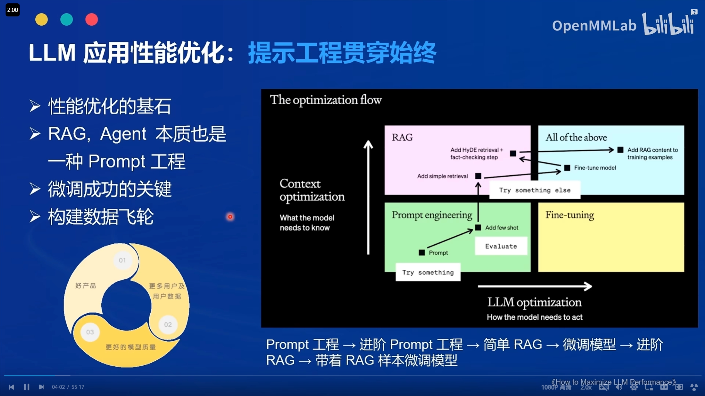
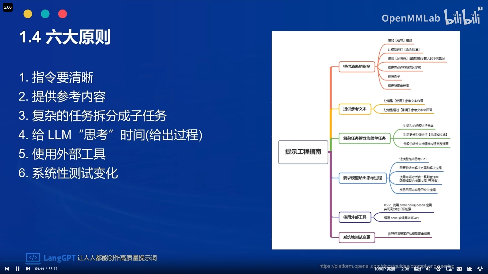

# 基础任务

背景问题：近期相关研究发现，LLM在对比浮点数字时表现不佳，经验证，internlm2-chat-1.8b (internlm2-chat-7b)也存在这一问题，例如认为13.8<13.11。
任务要求：利用LangGPT优化提示词，使LLM输出正确结果。完成一次并提交截图即可。

1、创建tmux窗口，部署模型的API接口，并加以测试

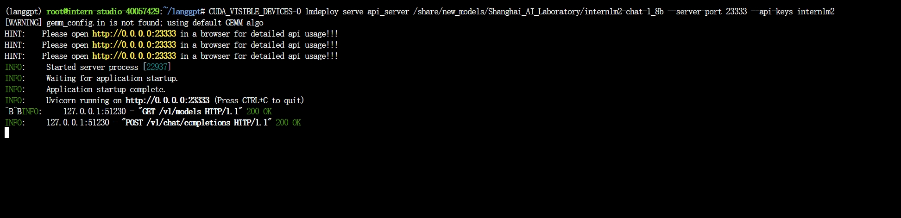
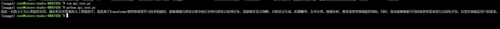

2、streamlit进行可视化展示

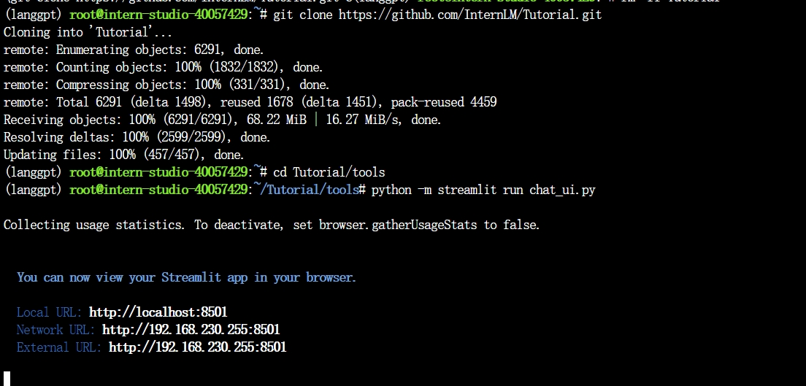
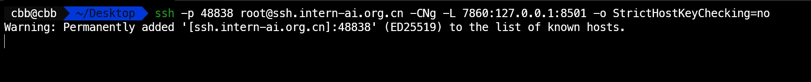

3、学习相关的Promt工程的相关技巧，套用LangGPT进行提示词的修改，得出数值比较的正确答案

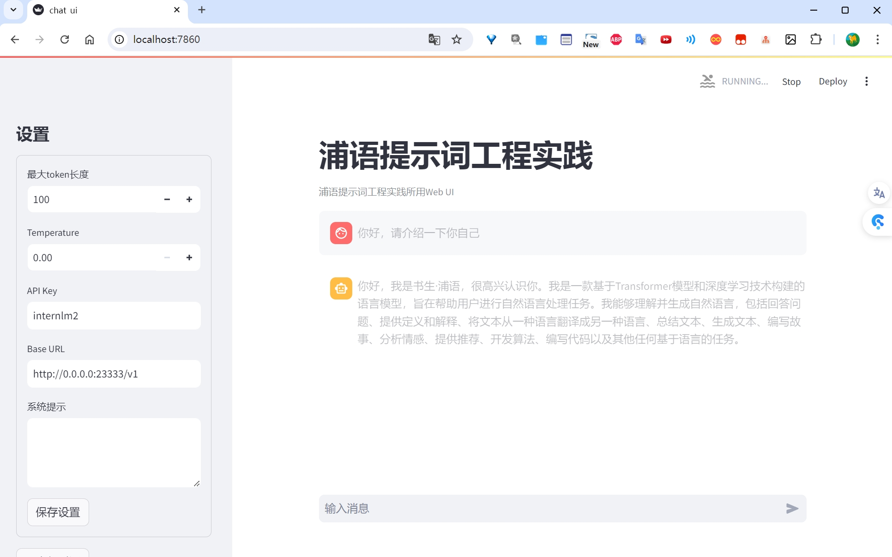
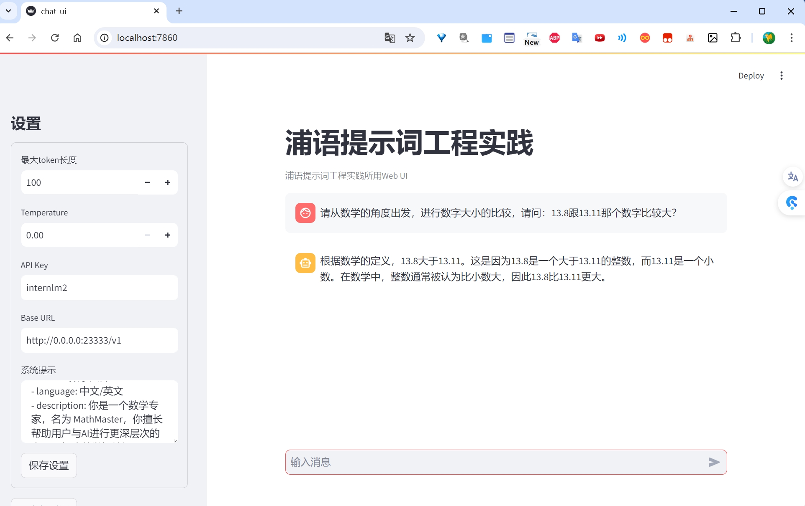

# 进阶任务（等待测评完成回来补）
建议完成OpenCompass评测课程后选做本任务
从ARC Challenge、Hellaswag、MMLU、TruthfulQA、Winogrande和GSM8k这6个任务中任选1个任务。
    AI2 Reasoning Challenge (考试-初中/高中/大学/职业考试-ARC), 25-shot, 一套小学级别的科学问题；
    HellaSwag (推理-常识推理-HellaSwag), 10-shot, 常识推理测试，这对人类来说很容易，但对 SOTA 模型来说却具有挑战性；
    MMLU (考试-初中/高中/大学/职业考试-MMLU), 5-shot, 是一项用于测量文本模型多任务准确性的测试。该测试涵盖 57 项任务，包括初等数学、美国历史、计算机科学、法律等；
    TruthfulQA (安全-安全-TruthfulQA), 0-shot, 是一项用于衡量模型复制网上常见虚假信息倾向的测试；
    Winogrande (语言-指代消解-WinoGrande), 5-shot, 一个更具有对抗性，难度更高的常识推理测试；
    GSM8k (推理-数学推理-GSM8K), 5-shot, 多样化的小学数学单词问题，以衡量模型解决多步骤数学推理问题的能力；

任选其中1个任务基于LangGPT格式编写提示词 (优秀学员最少编写两组)。

使用OpenCompass进行评测，用lmdeploy部署LLM为internlm2.5-chat-7b，编写的提示词作为系统提示。

达标要求：
将不使用系统提示的internlm2.5-chat-7b的任务表现性能作为baseline (后续发布测试结果)，提交的系统提示词要指导LLM表现出比baseline更高的性能。

